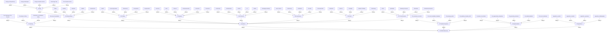

# FCS Graph

```mermaid
graph TD
    ELYSIUM_ROOT["ELYSIUM Manuscript"]
    PART_01["01 Opening"]
    PART_02["Foundations"]
    PART_03["03 Transition Dynamics"]
    PART_04["04 Implementation"]
    PART_05["05 Appendices"]
    P01_M01_pathology_of_present["The Pathology of the Present"]
    P01_M02_illusion_of_silos["The Illusion of Silos"]
    P01_M03_metabolic_entity["Civilization as a Metabolic Entity"]
    P01_M04_the_seven_foundations["The Seven Foundations"]
    F01_material_base["F01 Material Base"]
    F02_vitality["F02 Vitality"]
    F03_agency["F03 Agency"]
    F04_cohesion["F04 Cohesion"]
    F05_governance["F05 Governance"]
    F06_vision["F06 Vision"]
    F07_consciousness["F07 Consciousness"]
    F01_01["Energy"]
    F01_02["Water"]
    F01_05["Mobility"]
    F01_06["Materials"]
    F01_03["Habitat"]
    F01_04["Infrastructure"]
    F01_01_M01["Energy as Dependency"]
    F01_01_M02["Energy Pathologies"]
    F01_01_M03["Energy Transition Vectors"]
    F01_01_M01_energy_trap["The Energy Trap"]
    F01_01_M02_energy_transition["The Transition Vector"]
    F02_01["Health"]
    F02_02["Food & Agriculture"]
    F02_03["Biodiversity"]
    F02_04["Ecosystems"]
    F02_05["Regeneration"]
    F03_01["Economy"]
    F03_02["Work"]
    F03_03["Finance"]
    F03_04["Entrepreneurship"]
    F03_05["Innovation"]
    F03_06["Production"]
    F04_01["Community"]
    F04_02["Relationships"]
    F04_03["Culture"]
    F04_04["Art"]
    F04_05["Media"]
    F04_06["Belonging & Identity"]
    F05_01["Law & Justice"]
    F05_02["Democracy"]
    F05_03["Institutions"]
    F05_04["Security"]
    F05_05["Communication"]
    F06_01["Education"]
    F06_02["Science"]
    F06_03["Foresight"]
    F06_04["Systems Thinking"]
    F06_05["Technology"]
    F07_01["Ethics"]
    F07_02["Spirituality"]
    F07_03["Meaning & Purpose"]
    F07_04["Worldview"]
    F07_05["Civilizational Direction"]
    P03_M_01_mechanics_of_lockin["01_mechanics_of_lockin"]
    P03_M_02_cross_foundation_feedback["02_cross_foundation_feedback"]
    P03_M_03_leverage_points["03_leverage_points"]
    P03_M_04_anatomy_of_phase_shift["04_anatomy_of_phase_shift"]
    P04_M_01_stance_of_architect["01_stance_of_architect"]
    P04_M_02_regenerative_enterprises["02_regenerative_enterprises"]
    P04_M_03_governing_commons["03_governing_commons"]
    P04_M_04_resilient_habitats["04_resilient_habitats"]
    P04_M_05_role_of_individual["05_role_of_individual"]
    P05_M_appendix_a_matrix["appendix_a_matrix"]
    P05_M_appendix_b_models["appendix_b_models"]
    P05_M_appendix_c_glossary["appendix_c_glossary"]
    P05_M_appendix_d_bibliography["appendix_d_bibliography"]
    PART_01 -->|child_of| ELYSIUM_ROOT
    PART_02 -->|child_of| ELYSIUM_ROOT
    PART_03 -->|child_of| ELYSIUM_ROOT
    PART_04 -->|child_of| ELYSIUM_ROOT
    PART_05 -->|child_of| ELYSIUM_ROOT
    P01_M01_pathology_of_present -->|child_of| PART_01
    P01_M02_illusion_of_silos -->|child_of| PART_01
    P01_M03_metabolic_entity -->|child_of| PART_01
    P01_M04_the_seven_foundations -->|child_of| PART_01
    F01_material_base -->|child_of| PART_02
    F02_vitality -->|child_of| PART_02
    F03_agency -->|child_of| PART_02
    F04_cohesion -->|child_of| PART_02
    F05_governance -->|child_of| PART_02
    F06_vision -->|child_of| PART_02
    F07_consciousness -->|child_of| PART_02
    F01_01 -->|child_of| F01_material_base
    F01_02 -->|child_of| F01_material_base
    F01_05 -->|child_of| F01_material_base
    F01_06 -->|child_of| F01_material_base
    F01_03 -->|child_of| F01_material_base
    F01_04 -->|child_of| F01_material_base
    F01_01_M01 -->|child_of| F01_01
    F01_01_M02 -->|child_of| F01_01
    F01_01_M03 -->|child_of| F01_01
    F01_01_M01_energy_trap -->|child_of| F01_01
    F01_01_M02_energy_transition -->|child_of| F01_01
    F02_01 -->|child_of| F02_vitality
    F02_02 -->|child_of| F02_vitality
    F02_03 -->|child_of| F02_vitality
    F02_04 -->|child_of| F02_vitality
    F02_05 -->|child_of| F02_vitality
    F03_01 -->|child_of| F03_agency
    F03_02 -->|child_of| F03_agency
    F03_03 -->|child_of| F03_agency
    F03_04 -->|child_of| F03_agency
    F03_05 -->|child_of| F03_agency
    F03_06 -->|child_of| F03_agency
    F04_01 -->|child_of| F04_cohesion
    F04_02 -->|child_of| F04_cohesion
    F04_03 -->|child_of| F04_cohesion
    F04_04 -->|child_of| F04_cohesion
    F04_05 -->|child_of| F04_cohesion
    F04_06 -->|child_of| F04_cohesion
    F05_01 -->|child_of| F05_governance
    F05_02 -->|child_of| F05_governance
    F05_03 -->|child_of| F05_governance
    F05_04 -->|child_of| F05_governance
    F05_05 -->|child_of| F05_governance
    F06_01 -->|child_of| F06_vision
    F06_02 -->|child_of| F06_vision
    F06_03 -->|child_of| F06_vision
    F06_04 -->|child_of| F06_vision
    F06_05 -->|child_of| F06_vision
    F07_01 -->|child_of| F07_consciousness
    F07_02 -->|child_of| F07_consciousness
    F07_03 -->|child_of| F07_consciousness
    F07_04 -->|child_of| F07_consciousness
    F07_05 -->|child_of| F07_consciousness
    P03_M_01_mechanics_of_lockin -->|child_of| PART_03
    P03_M_02_cross_foundation_feedback -->|child_of| PART_03
    P03_M_03_leverage_points -->|child_of| PART_03
    P03_M_04_anatomy_of_phase_shift -->|child_of| PART_03
    P04_M_01_stance_of_architect -->|child_of| PART_04
    P04_M_02_regenerative_enterprises -->|child_of| PART_04
    P04_M_03_governing_commons -->|child_of| PART_04
    P04_M_04_resilient_habitats -->|child_of| PART_04
    P04_M_05_role_of_individual -->|child_of| PART_04
    P05_M_appendix_a_matrix -->|child_of| PART_05
    P05_M_appendix_b_models -->|child_of| PART_05
    P05_M_appendix_c_glossary -->|child_of| PART_05
    P05_M_appendix_d_bibliography -->|child_of| PART_05
```
