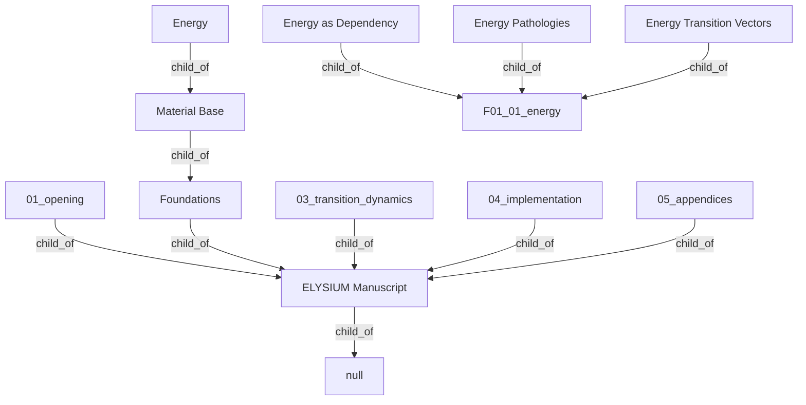

# FCS Graph

```mermaid
graph TD
    ELYSIUM_ROOT["ELYSIUM Manuscript"]
    01_opening["01_opening"]
    PART_02["Foundations"]
    03_transition_dynamics["03_transition_dynamics"]
    04_implementation["04_implementation"]
    05_appendices["05_appendices"]
    F01_material_base["Material Base"]
    F01_01["Energy"]
    F01_01_M01["Energy as Dependency"]
    F01_01_M02["Energy Pathologies"]
    F01_01_M03["Energy Transition Vectors"]
    ELYSIUM_ROOT -->|child_of| null
    01_opening -->|child_of| ELYSIUM_ROOT
    PART_02 -->|child_of| ELYSIUM_ROOT
    03_transition_dynamics -->|child_of| ELYSIUM_ROOT
    04_implementation -->|child_of| ELYSIUM_ROOT
    05_appendices -->|child_of| ELYSIUM_ROOT
    F01_material_base -->|child_of| PART_02
    F01_01 -->|child_of| F01_material_base
    F01_01_M01 -->|child_of| F01_01_energy
    F01_01_M02 -->|child_of| F01_01_energy
    F01_01_M03 -->|child_of| F01_01_energy
```
