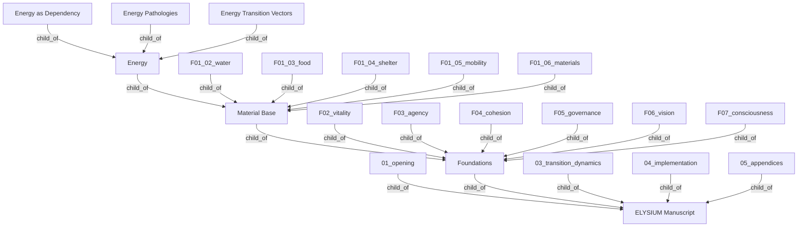

# FCS Graph

```mermaid
graph TD
    ELYSIUM_ROOT["ELYSIUM Manuscript"]
    01_opening["01_opening"]
    PART_02["Foundations"]
    03_transition_dynamics["03_transition_dynamics"]
    04_implementation["04_implementation"]
    05_appendices["05_appendices"]
    F01_material_base["Material Base"]
    F02_vitality["F02_vitality"]
    F03_agency["F03_agency"]
    F04_cohesion["F04_cohesion"]
    F05_governance["F05_governance"]
    F06_vision["F06_vision"]
    F07_consciousness["F07_consciousness"]
    F01_01["Energy"]
    F01_02_water["F01_02_water"]
    F01_03_food["F01_03_food"]
    F01_04_shelter["F01_04_shelter"]
    F01_05_mobility["F01_05_mobility"]
    F01_06_materials["F01_06_materials"]
    F01_01_M01["Energy as Dependency"]
    F01_01_M02["Energy Pathologies"]
    F01_01_M03["Energy Transition Vectors"]
    01_opening -->|child_of| ELYSIUM_ROOT
    PART_02 -->|child_of| ELYSIUM_ROOT
    03_transition_dynamics -->|child_of| ELYSIUM_ROOT
    04_implementation -->|child_of| ELYSIUM_ROOT
    05_appendices -->|child_of| ELYSIUM_ROOT
    F01_material_base -->|child_of| PART_02
    F02_vitality -->|child_of| PART_02
    F03_agency -->|child_of| PART_02
    F04_cohesion -->|child_of| PART_02
    F05_governance -->|child_of| PART_02
    F06_vision -->|child_of| PART_02
    F07_consciousness -->|child_of| PART_02
    F01_01 -->|child_of| F01_material_base
    F01_02_water -->|child_of| F01_material_base
    F01_03_food -->|child_of| F01_material_base
    F01_04_shelter -->|child_of| F01_material_base
    F01_05_mobility -->|child_of| F01_material_base
    F01_06_materials -->|child_of| F01_material_base
    F01_01_M01 -->|child_of| F01_01
    F01_01_M02 -->|child_of| F01_01
    F01_01_M03 -->|child_of| F01_01
```
